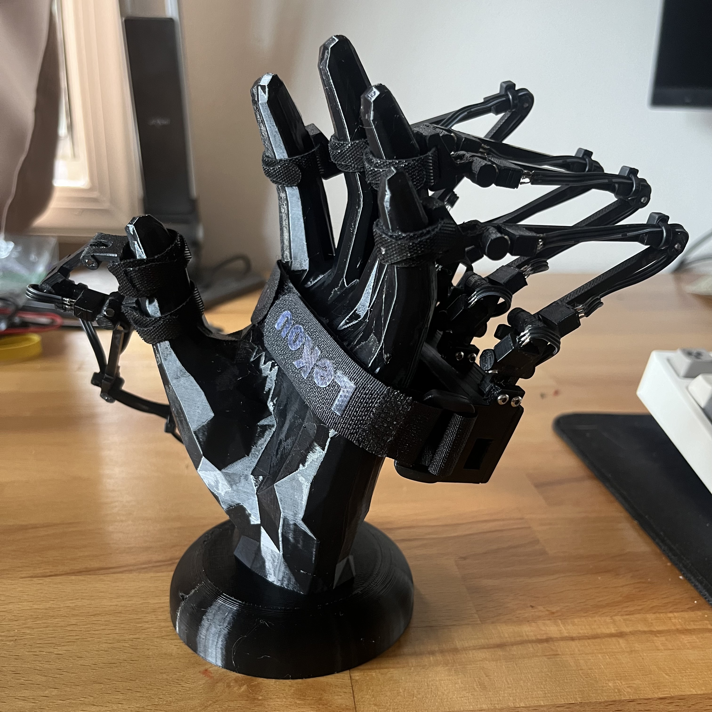

# Finger Tracker Glove

Hardware that attaches to the back of your hand and fingertips that tracks 16 degrees of freedom. 

  
   

## Description

The glove uses rotating neodymium magnets and hall effect sensors at each joint to measure rotation. The thumb has 4 sensors and the fingers have 3 each. Each sensor is wired up to a multiplexer and powered with a common GND/VCC strip. I used a XIAO ESP32C3 as the microcontroller for its small form factor. This project builds upon Nepyope's glove shown here: [Youtube](https://www.youtube.com/watch?v=iPtgvh6fNdQ).

## Getting Started

### 3D Printing

All the files are in the CAD folder. For Nepyope's parts I have just the STL with all of the pieces (and I dont use all of them). For my parts I have all of them as STLs and most of them have SLDPT and STEP versions.

Nepyope's Parts:
* 16x sensor boxes and lids
* Connecting rods (12 total, I used 11 of them as I changed one)
* 4x Finger second piece
* Thumb second piece

You can print the STL with all the parts and just use the ones listed above

My Parts:
* Enclosure
* Enclosure top
* Thumb bracket
* 4x finger endpiece
* Thumb endpiece
* Thumb middle piece
* Thumb first piece
* Thumb short rod (flipped from nepyope’s design)
* 4x Finger first joint

### Mechanical Hardware

* Finger straps [Amazon](https://www.amazon.com/dp/B0CJ52WJZY?ref=ppx_yo2ov_dt_b_fed_asin_title&th=1)
* Hand strap [Amazon](https://www.amazon.com/dp/B07CWV5JCT?ref=ppx_yo2ov_dt_b_fed_asin_title)
* 2mm steel pins
* M2 bolts and inserts
* M3 bolts and inserts
* 3mm by 3mm circular neodymium magnets [Amazon](https://www.amazon.com/dp/B0CCXYF5TR?ref=ppx_yo2ov_dt_b_fed_asin_title)

### Electrical Hardware

* Xiao ESP32C3
* 16 channel multiplexer [Amazon](https://www.amazon.com/dp/B01DLHKLNE?psc=1&ref=ppx_yo2ov_dt_b_product_details)
* 2.54mm pins
* 28 gauge 3 wire
* 28 gauge 1 wire
* 16x hall effect sensor [Amazon](https://www.amazon.com/dp/B09XQPCYNX?ref=ppx_yo2ov_dt_b_fed_asin_title)
* Flexible pcb [Adafruit](https://www.adafruit.com/product/1518?gad_source=1&gclid=CjwKCAjwufq2BhAmEiwAnZqw8sdsNhCVOsYyNnKK1pq94dwK_rFcY--OIT8TiFCtQYdgxBPCs89ElxoCQ-cQAvD_BwE)

### Tools

* Soldering tools (iron, solder, flux, etc)
* Cutters, wire stripers, etc
* Superglue
* 1.5mm and 2.5mm allen keys

### Firmware

The firmware was made using PlatformIO in the Arduino framework. You can comment and uncomment the print functions to print raw values, adjusted angle values, or all the values in a single string. The raw value and adjusted angle values print in a way where Teleplot (serial plotter VSCode extension) can read and plot them. A teleplot layout is in the teleplot folder.

## License

This project is licensed under the MIT License - see the LICENSE file for details

## Acknowledgments

* [Nepyope Youtube](https://www.youtube.com/watch?v=iPtgvh6fNdQ)
* [Nepyope Github](https://github.com/nepyope/Project-Homunculus/tree/main)
